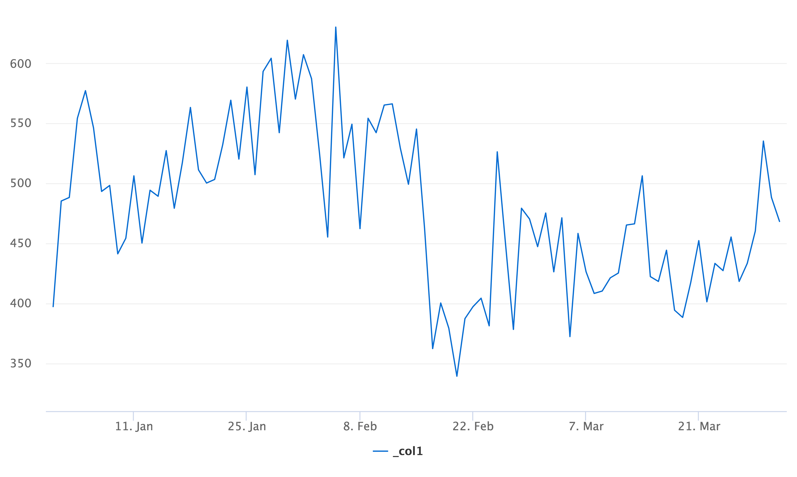

# Question 1
## Please  review  the  integrity  of  the  data.  Do  you  notice  any  data  anomalies?  If  so,  please  describe  them.

For this I uploaded the csv files into separate Hive tables and will use Presto to run queries on. Table names are in the format of: tmp_msadowski_filename.

The merchants dataset was a simple static table with no NULL values. The categories gave me a slight pause as they can be quite general. For example, Music being mapped to a company that sells musical instruments. When I read Music my first thought are companies selling music subscriptions, software, and downloadable files. 

Moving to the loans table, I found a few issues that I would want to change. First is the date format of the `checkout_date` column. Even though it's a date column, it has an odd hour:month format at the end of it. So if I wanted to answer a basic question like "what was the daily count of check outs?" I had to do something like the following: `SELECT DATE_FORMAT(DATE_PARSE(checkout_date, '%m/%d/%y %k:%i'), '%Y-%m-%d'), COUNT(*) FROM tmp_msadowski_loans GROUP BY DATE_FORMAT(DATE_PARSE(checkout_date, '%m/%d/%y %k:%i'), '%Y-%m-%d')`. This specific query also highlighted a large drop in checkouts on February 17th, 2016. There are no missing values in the `checkout_date` column, so that leads me to think there was either a product issue/change around this time, or there was a potential data logging issue.

Graph showing the drop: 
