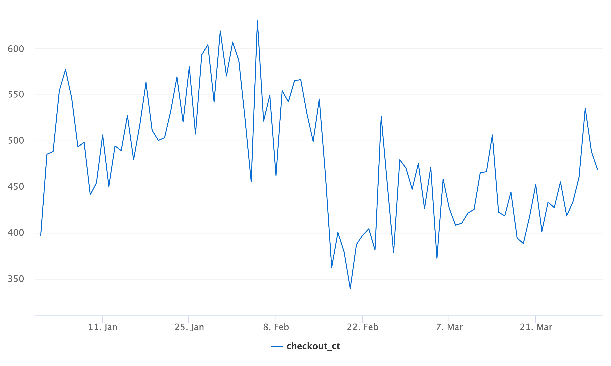
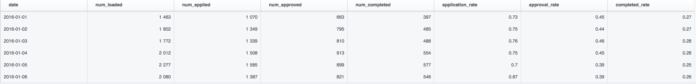

# Question 1
## Please  review  the  integrity  of  the  data.  Do  you  notice  any  data  anomalies?  If  so,  please  describe  them.

For this I uploaded the csv files into separate Hive tables and will use Presto to run queries on. Table names are in the format of: tmp_msadowski_filename.

The merchants dataset is a simple static table with no NULL values. 

Moving to the loans table, I found a few issues that I would want to change. First is the date format of the `checkout_date` column. Even though it's a date column, it has an odd hour:month format at the end of it. So if I wanted to answer a basic question like "what was the daily count of check outs?" I had to do something like the following: `SELECT DATE_FORMAT(DATE_PARSE(checkout_date, '%m/%d/%y %k:%i'), '%Y-%m-%d'), COUNT(*) FROM tmp_msadowski_loans GROUP BY DATE_FORMAT(DATE_PARSE(checkout_date, '%m/%d/%y %k:%i'), '%Y-%m-%d')`. This specific query also highlighted a large drop in checkouts on February 17th, 2016. Of the three months of data we have, January was the best performing one if based on daily checkouts. You'd expect January to be more sluggish due to holiday spending from November and December.

Graph showing the drop: 

It becomes partly apparent why when you graph the resulting query I created in question 2. An entire week of data is missing from the data set, February 22nd to the 28th. So that explains the initial drop, but by just visually looking at the graph it seems clear that we are looking at a kind of structural break in the time series as it never recovers to the levels in January.

Another thing that stuck out to me was the `users_first_capture` column. Instead of using NULL, there is a default value of 0 being used. This could be confusing to some when they may go to check data integrity on the table by using some `ISNULL` logic without checking individual rows with a manual expection. Having a default value of 0 can make sense for certain types of columns, but should not be used in date columns to signify a NULL value. This kind of default value treatment also leads us to ambiguity when looking at other columns in this table such as `mdr` and `fico_score`. Does a 0 mdr (which the dataset has 47 occurrances of) mean we gave the merchant(s) a zero percent fee promo or is this a NULL results? Does a 0 fico score mean a NULL result, or is that a brand new customer in the financial space that has yet to age an account 6 months, which is required to have a fico score? It's not clear with the data that we have.

As I was exploring customer/market segments in question 3 I also noticed that the last few days in market there seems to be about 20-40 events per daily with a NULL market category. We likely had a new merchant launch and hasn't had a category assigned to them, or they are a new category all together which needs to be put into the static merchants table.

Finally, the checkout table. Besides the same things I pointed out above (zero default values and poor date formatting), nothing from a technical data issue stuck out to me. I looked at various things such as the number of events for each step in the funnel per merchant to make sure the numbers were monotonically decreasing:
`SELECT merchant_id, action, COUNT(*) AS ct FROM tmp_msadowski_funnel GROUP BY merchant_id, action ORDER BY merchant_id, COUNT(*) DESC`

One thing that did stick out, but I consider more of an interesting EDA find than a technical data issue is that when I pivoted the funnel column I find that the max date difference between step 1 and 2 of the funnel (Checkout Loaded -> Loan Terms Run) was 34 days. The other funnel steps were within 2 days or less. Query:
```sql
SELECT 
    MAX(DATE_DIFF('day',a1,a2)) AS max_a1a2,
    MAX(DATE_DIFF('day',a2,a3)) AS max_a2a3,
    MAX(DATE_DIFF('day',a3,a4)) AS max_a3a4,
    MIN(DATE_DIFF('day',a1,a2)) AS min_a1a2,
    MIN(DATE_DIFF('day',a2,a3)) AS min_a2a3,
    MIN(DATE_DIFF('day',a3,a4)) AS min_a3a4
FROM
(
SELECT
    checkout_id,
    CAST(MAX(CASE WHEN action = 'Checkout Loaded' THEN DATE_FORMAT(DATE_PARSE(action_date, '%m/%d/%y %k:%i'), '%Y-%m-%d') END) AS DATE) AS a1,
    CAST(MAX(CASE WHEN action = 'Loan Terms Run' THEN DATE_FORMAT(DATE_PARSE(action_date, '%m/%d/%y %k:%i'), '%Y-%m-%d') END) AS DATE) AS a2,
    CAST(MAX(CASE WHEN action = 'Loan Terms Approved' THEN DATE_FORMAT(DATE_PARSE(action_date, '%m/%d/%y %k:%i'), '%Y-%m-%d') END) AS DATE) as a3,
    CAST(MAX(CASE WHEN action = 'Checkout Completed' THEN DATE_FORMAT(DATE_PARSE(action_date, '%m/%d/%y %k:%i'), '%Y-%m-%d') END) AS DATE) as a4
FROM tmp_msadowski_funnel
GROUP BY checkout_id
)
```

# Question 2
## Calculate  conversion  through  the  funnel  by  day  such  that  the  data  structure  is...

```sql
SELECT
    date,
    num_loaded,
    num_applied,
    num_approved,
    num_completed,
    ROUND(num_applied * 1.0 / num_loaded, 2) AS application_rate,
    ROUND(num_approved * 1.0 / num_loaded, 2) AS approval_rate,
    ROUND(num_completed * 1.0 / num_loaded, 2) AS completed_rate
FROM
(
    SELECT 
        DATE_FORMAT(DATE_PARSE(action_date, '%m/%d/%y %k:%i'), '%Y-%m-%d') AS date,
        COUNT_IF(action = 'Checkout Loaded') AS num_loaded,
        COUNT_IF(action = 'Loan Terms Run') AS num_applied,
        COUNT_IF(action = 'Loan Terms Approved') AS num_approved,
        COUNT_IF(action = 'Checkout Completed') AS num_completed
    FROM tmp_msadowski_funnel
    GROUP BY DATE_FORMAT(DATE_PARSE(action_date, '%m/%d/%y %k:%i'), '%Y-%m-%d')
)
ORDER by date ASC
```
Here are the first few rows generated from the query above:


