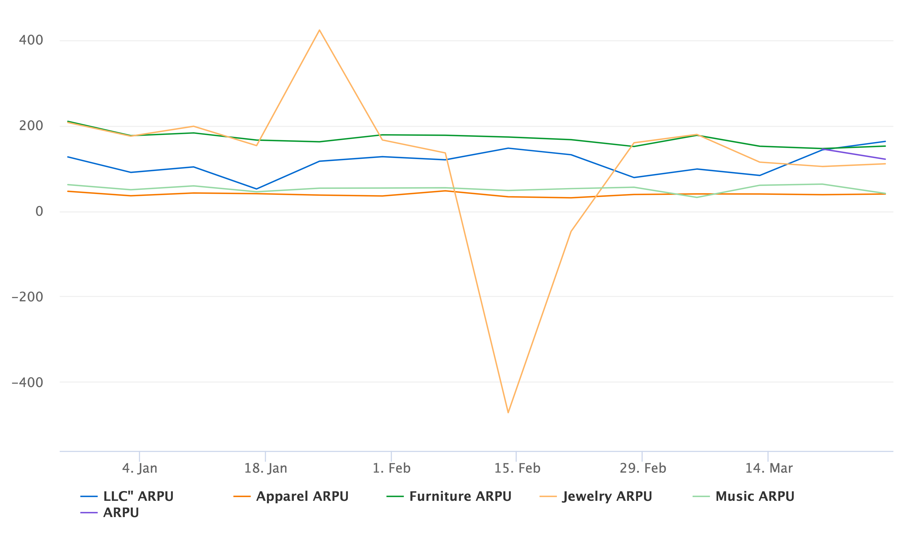

# Question 3 Supplemental
One area I'd like to spend more time on a BD perspective is drilling into the music merchant segment and why it is performing the way it is. Music is the 2nd highest segment w.r.t. weekly application submission trailing only apparel, and yet it is the worst performing segment from an approval percentage. It can't be due to fraud reasons, apparel is significantly easier to buy fraudulently and sell in various marketplaces and yet it has a significantly higher approval percentage. Can't be because of item cost as furniture also has a much better approval rating. It's more likely a combination of high cost and young/little-to-no credit history buyers. Apparel skews young, but loans are much smaller, whereas furniture is high dollar amounts, but has more mature customers. 

Had limited room in the PowerPoint, so I only included 2 of the 3 graps I wanted to show. My third would have been ARPU.  Music ARPU hovers around $55:
```sql
SELECT
    week_start_sunday,
    category,
    SUM((CAST(mdr AS DOUBLE)+CAST(loan_return_percentage AS DOUBLE))*(CAST(loan_amount AS DOUBLE))) / COUNT(*) AS ARPU
FROM
	tmp_msadowski_loans a
LEFT JOIN tmp_msadowski_merchants b
    ON a.merchant_id = b.merchant_id
LEFT JOIN dim_date:operations c
    ON DATE_FORMAT(DATE_PARSE(a.checkout_date, '%m/%d/%y %k:%i'), '%Y-%m-%d') = c.dateid
GROUP BY
    week_start_sunday,
    category
ORDER BY
    week_start_sunday,
    category
```



