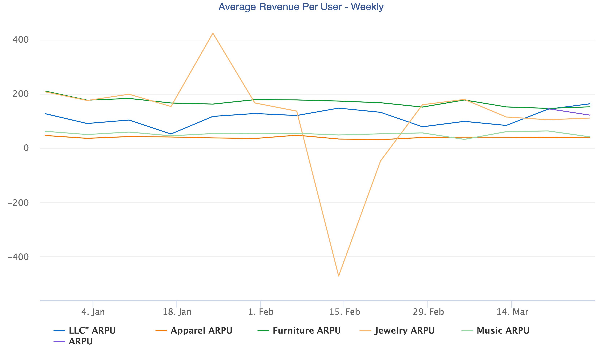

# Question 3 Supplemental
One area I'd like to spend more time on a BD perspective is drilling into the music merchant segment and why it is performing the way it is. Music is the 2nd highest segment w.r.t. weekly application submission trailing only apparel, and yet it is the worst performing segment from an approval percentage. It can't be due to fraud reasons, apparel is significantly easier to buy fraudulently and sell in various marketplaces and yet it has a significantly higher approval percentage. Can't be because of item cost as furniture also has a much better approval rating. It's more likely a combination of high cost and young/little-to-no credit history buyers. Apparel skews young, but loans are much smaller, whereas furniture is high dollar amounts, but has more mature customers.

Found it quite surprising how few checkouts are loaded via jewelry (with the assumption of equal saturation). This is a highly risky segment as it's very easy to move jewelry after it is acquired from a fraudster, but I would expect fraudsters to be able to at least enter into the flow before encountering any risk/compliance checks that Affirm may run. For the few checkouts that were completed in jewelry, there is quite a high ARPU in the range of $175-200, so it's an area that should have some additional BD resources to help solve the low checkout starts.

Since you only asked for two and I was running out of time I didn't look at some other data splits I had in mind. One was looking at loans that we lost money on. During question 1 I noticed that we lost money on ~7% of loans. Spending some time there to see if that number is dominated by a specific merchant or customer segment would also be useful.

Queries used to gather the data for the three graphs used for question 3:
## ARPU
```sql
SELECT
    week_start_sunday,
    category,
    --accidentally uploaded everything as a STRING, so needed to do multiple CASTS
    SUM((CAST(mdr AS DOUBLE)+CAST(loan_return_percentage AS DOUBLE))*(CAST(loan_amount AS DOUBLE))) / COUNT(*) AS ARPU
FROM
	tmp_msadowski_loans a
LEFT JOIN tmp_msadowski_merchants b
    ON a.merchant_id = b.merchant_id
LEFT JOIN dim_date:operations c
    ON DATE_FORMAT(DATE_PARSE(a.checkout_date, '%m/%d/%y %k:%i'), '%Y-%m-%d') = c.dateid
GROUP BY
    week_start_sunday,
    category
ORDER BY
    week_start_sunday,
    category
```



## num_loads and approval percentage
```sql
SELECT
    action_date,
    category,
    num_loaded,
    num_applied,
    num_approved,
    num_completed,
    ROUND(num_applied * 1.0 / num_loaded, 2) AS application_rate,
    ROUND(num_approved * 1.0 / num_loaded, 2) AS approval_rate,
    ROUND(num_completed * 1.0 / num_loaded, 2) AS completed_rate
FROM
(
    SELECT 
        DATE_FORMAT(DATE_PARSE(action_date, '%m/%d/%y %k:%i'), '%Y-%m-%d') AS action_date,
        category,
        COALESCE(COUNT_IF(action = 'Checkout Loaded'), 0) AS num_loaded,
        COALESCE(COUNT_IF(action = 'Loan Terms Run'), 0) AS num_applied,
        COALESCE(COUNT_IF(action = 'Loan Terms Approved'), 0) AS num_approved,
        COALESCE(COUNT_IF(action = 'Checkout Completed'), 0) AS num_completed
    FROM tmp_msadowski_funnel a
    LEFT JOIN tmp_msadowski_merchants b
        ON a.merchant_id = b.merchant_id
    GROUP BY 
        DATE_FORMAT(DATE_PARSE(action_date, '%m/%d/%y %k:%i'), '%Y-%m-%d'),
        category
)
ORDER by 
    action_date, 
    category
```


